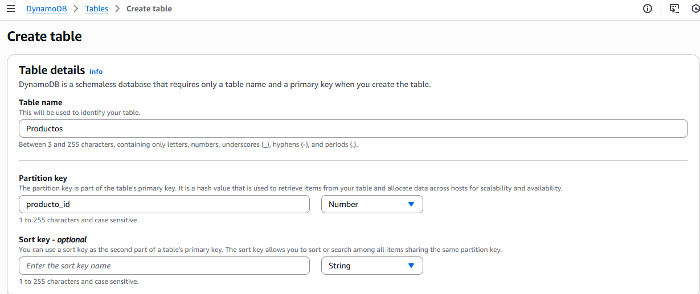
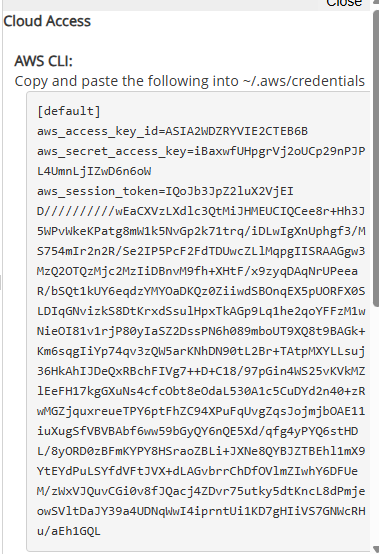
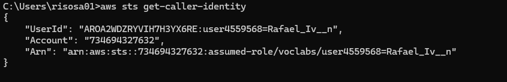
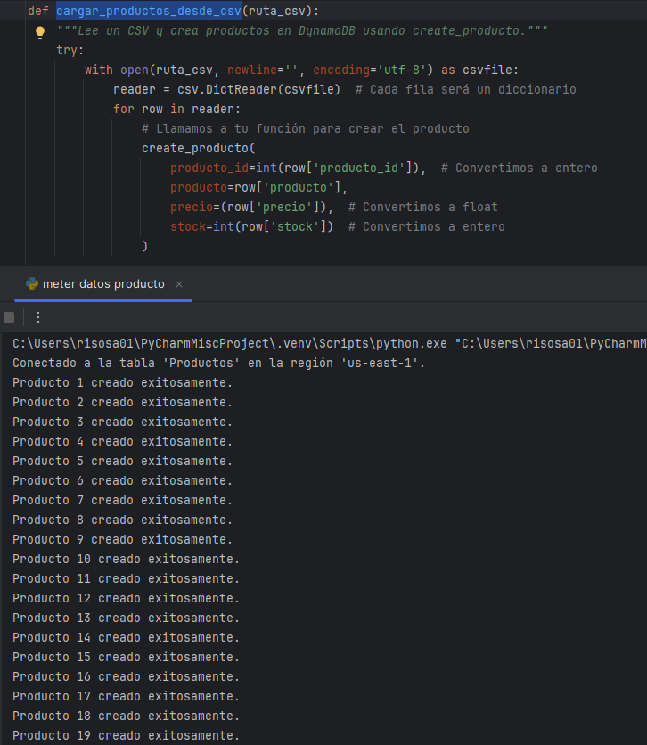
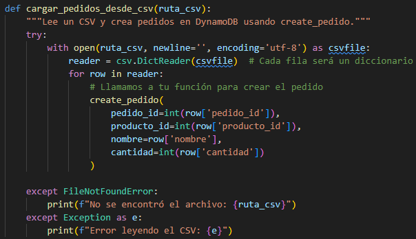
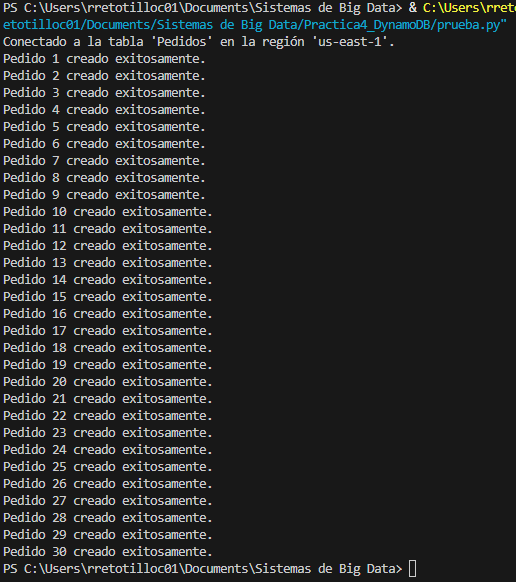
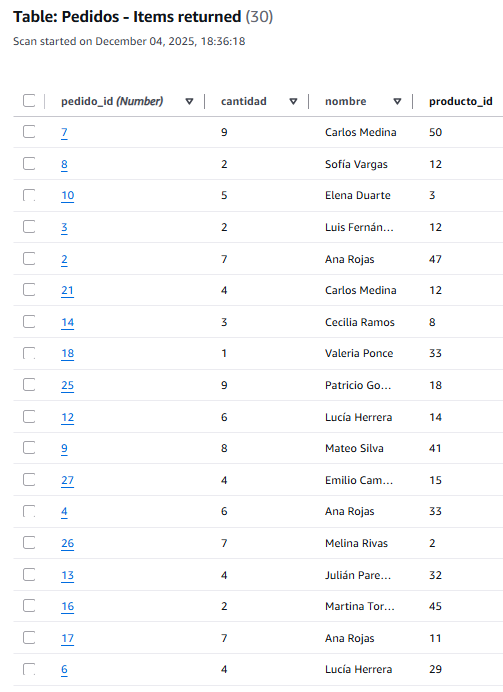

# Tienda Online Productos

---

# 1. Modelado de un Problema de Negocio Real

### 1.1 Definición del problema:

**Definición del problema:** Tenemos una tienda en la cual vendemos **Productos** en los cuales tenemos en cuenta los **Pedidos**, para poder hacer filtros de los datos y saber quienes son los usuarios que compran y saber los productos que tenemos en stock.

En nuestro caso nos ha tocado la opcion de Volumen de datos (Esquema), teniendo este enunciado:

Debes generar e insertar un mínimo de 50 registros simulados para demostrar el manejo de un volumen significativo de datos.

# 2. Análisis y Justificación de la Base de Datos

* Elección: Nosotros elegimos DynamoDB.
* Documentación Técnica:

    * DynamoDB es una base de datos NoSQL administrada por AWS basada en un modelo de clave–valor y documentos JSON. Los datos se almacenan en ítems flexibles sin esquema fijo.

    * Su lenguaje principal de operación es la DynamoDB API mediante operaciones como PutItem, Query y UpdateItem, aunque también soporta PartiQL, un lenguaje de consulta compatible con SQL.

    * Sus características clave incluyen ser totalmente gestionada, escalable, serverless, con soporte para documentos complejos y opciones de consistencia configurable.

* **Justificación elección modelo:** En nuestro caso elegimos la opción de DynamoDB, por su sencilla manera de usar codigo, la manera en la seguridad y saber que con una pequeña simplicidad de 2 lineas más de codigo podemos verificar si está subido de manera correcta, ademas por la velocidad de python. 

---

# 3. Desarollo de la aplicación.
# 1. Creamos las tablas manualmente.
## 1.1 Los detalles de la tabla  Productos son:

Table name: Productos
Partition key: producto_id

## 1.2 Los detalles de la tabla  pedidos son:

Table name: Pedidos
Partition key: pedido_id

# 2. Configuramos el AWS
Configuramos el aws desde nuestro CMD con las credenciales de AWS CLI.

Comprobamos si esta bien la conexion con aws.

# 3. Meter los datos,  mediante un for.

## Metemos los datos de productos y comprobamos que estan metidos.
Para ello utilizamos un script de python que nos permite añadir los datos desde un fichero .csv.

## Metemos los datos de pedidos y comprobamos que estan metidos.

Los dos scripts están en la carpeta funciones.

# 4. Desarrollo de la aplicación.
Utilizando flask hemos creado una api que nos permite hacer consultas y operaciones CRUD sobre los datos introducidos. Estas operaciones se pueden realizar a través del html de la carpeta "api y html".

## 4.1. Mostrar los datos.
Al abrir el html lo primero que se nos muestra es la tabla de pedidos.

También podemos consultar la tabla de productos.

## 4.2. Mostrar los datos por identificador único.
En la barra de la izquierda podemos realizar varias operaciones, la primera es buscar un pedido por su id.

## 4.3. Consulta avanzada para mostrar los pedidos de un usuario.
La siguiente operación es buscar todos los pedidos que ha realizado un usuario concreto.

## 4.4. Insertar nuevos datos.
Podemos añadir nuevos registros en la columna pedidos.

## 4.5. Actualizar un dato existente.
En la tabla de pedidos podemos cambiar la cantidad del producto comprado simplemente cambiando el valor.

## 4.6. Borrar un dato.
Para borrar un registro de la columna pedidos o productos pinchamos en la imagen de la papelera.

  
Ya no está el pedido con id 2.

