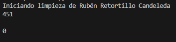
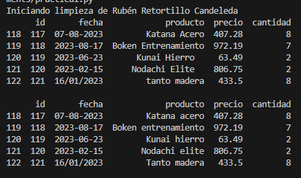
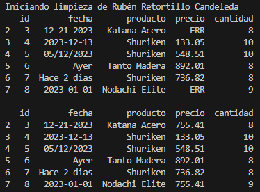
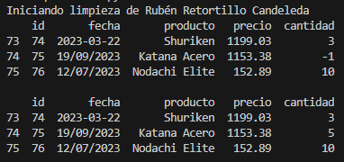
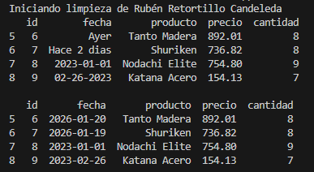
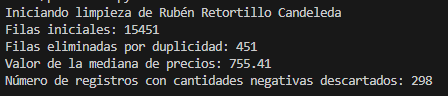

# Práctica 1: Hijo de la Forja - Limpieza de datos masivos.
En esta práctica se desarrollará un script de python que realizará diferentes tareas de limpieza, normalización y validación sobre un dataset de ventas.

## 1. Eliminación de duplicados.
Utilizamos estos comandos para saber cuantas filas tenemos duplicadas, eliminarlas y comprobar que se han eliminado.

```
print(df.duplicated().sum())

df = df.drop_duplicates()

print()
print(df.duplicated().sum())
```

</img>

Tenemos 451 filas duplicadas en un inicio y comprobamos que se eliminan.

<br></br>

## 2. Normalización de productos.
Con estos comando mostramos varias filas que contienen productos con espacios en blanco, los eliminamos, pasamos el formato a capitalizado y comprobamos que se han realizado los cambios.

```
print(df[118:123])

df["producto"] = df["producto"].str.strip()
df["producto"] = df["producto"].str.capitalize()

print()
print(df[118:123])
```

</img>

<br></br>

## 3. Tratamiento de precios.
Cambiamos valores no numéricos por nulos y utilizamos la mediana para rellanar esas filas.

```
print(df[2:8])

df["precio"] = df["precio"].apply(pd.to_numeric, errors='coerce')
df["precio"] = df["precio"].fillna(df["precio"].median())

print()
print(df[2:8])
```

</img>

<br></br>

## 4. Validación de cantidades.
Cambiamos la cantidad de aquellos productos cuya cantidad sea negativa y la cambiamos por la mediana.

```
print(df[73:76])

df.loc[df["cantidad"] < 0, "cantidad"] = df["cantidad"].median()

print()
print(df[73:76])
```

</img>

<br></br>

## 5. Estandarización temporal.
Desarrollamos una función que calcule la fecha cuando el valor sea "Ayer" o "Hace 2 dias". Además también convertirá todas las fechas al formato estándar ISO.

```
print(df[5:9])

def fecha(valor):

    hoy = datetime.now().date()
    texto = str(valor).strip().lower()

    if texto == "ayer":
        return hoy - timedelta(days=1)

    if texto == "hace 2 dias":
        return hoy - timedelta(days=2)
    
    try:
        return pd.to_datetime(texto, format="mixed", dayfirst=True).date()
    except Exception:
        return pd.NaT

df["fecha"] = df["fecha"].apply(fecha)

print()
print(df[5:9])
```

</img>

**En este ejercicio he utilizado chatGPT para sacarlo porque no había manera de que funcionara.**

<br></br>

## Bitácora
Imprime un resumen tras ejecutar el script.

</img>

<br></br>

## Preguntas de reflexión.
**1. ¿Cuántos registros se perdieron en total tras todo el proceso de limpieza?**

Se eliminaron 451 filas tras todo el proceso.

**2. ¿Hubo algún caso de id repetido con datos distintos? ¿Cómo decidiste manejarlo para no perder información?**

En el caso de que haya alguna fila en la que se repita el id pero no los demás datos no se eliminaría con el comando que he utilizado.

**3. ¿Por qué crees que es más seguro usar la mediana que la media para imputar precios en este dataset con errores manuales?**

Porque la media se ve muy distorsionada por valores extremos o incorrectos, y la mediana es más robusta.

## Conclusión
Un análisis exploratorio de datos y el procesamiento de los mismos es esencial para asegurar la calidad de la información. No realizar estos procesos conlleva tener una base de datos con información no fiable cuyo análisis puede llevar a decisiones erróneas.  