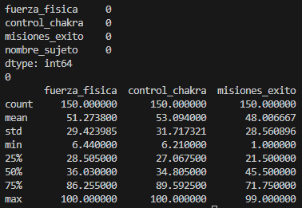
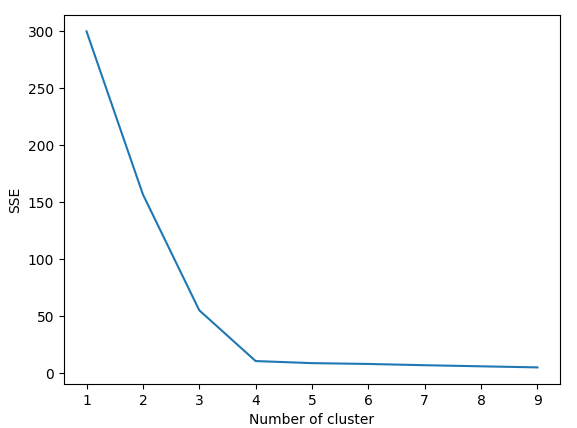
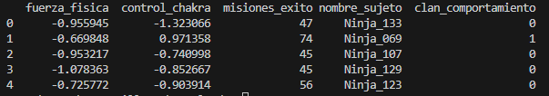
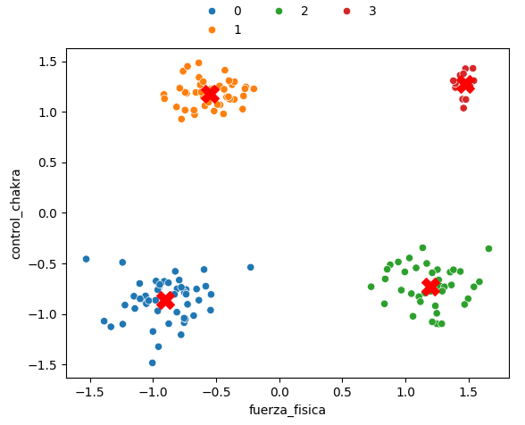

# Práctica 3. Selección para la gran alianza.
En esta práctica utilizaremos K-Means para segmentar un dataset en varios grupos.

## Ejercicio 1. Exploración y limpieza.
Compruebo que no hay valores nulos ni duplicados ni incoherentes en el dataset.

```
print(df.isnull().sum())

print(df.duplicated().sum())

print(df.describe())
```

</img>

Todos los datos parecen correctos.

<br></br>

## Ejericio 2. Encontrar el K óptimo.
Aplico el método del codo para encontrar el mejor valor para k.
```
sc = StandardScaler() # Standardization
df[["fuerza_fisica", "control_chakra"]] = sc.fit_transform(df[["fuerza_fisica", "control_chakra"]])

X = df[['fuerza_fisica', 'control_chakra']]

# Método del codo.
sse = {}
for k in range(1, 10):
    kmeans = KMeans(n_clusters=k, max_iter=1000).fit(X)
    X["clusters"] = kmeans.labels_
    sse[k] = kmeans.inertia_
plt.figure()
plt.plot(list(sse.keys()), list(sse.values()))
plt.xlabel("Number of cluster")
plt.ylabel("SSE")
plt.show()
```

</img>

El mejor valor para k es 4 porque es donde la gráfica se estabiliza y ya no mejora al añadir más clústers.

<br></br>

# Ejercicio 3. Entrenamiento y clasificación.
Entrenamos el modelos con la k elegida y añadimos una columna nueva al dataset con el valor del clúster correspondiente.
```
kmeans = KMeans(n_clusters=4, random_state=42, n_init=10)

df['clan_comportamiento'] = kmeans.fit_predict(X)

df.to_csv("aptitudes_ninja_final.csv")

print(df.head())
```

</img>

<br></br>

# Ejercicio 4. Mapa de especialidades.
Genero un gráfico donde se muestren los clústers y los centroides.
```
mapa = sns.scatterplot(data = X,
                       x = "fuerza_fisica",
                       y = "control_chakra",
                       hue = df["clan_comportamiento"],
                       palette = "tab10")
sns.move_legend(
    mapa, "lower center",
    bbox_to_anchor=(.5, 1), ncol=3, title=None, frameon=False,
)

centroides = kmeans.cluster_centers_
plt.scatter(centroides[:, 0],centroides[:, 1], c='red', marker='X', s=200)
plt.show()
```

</img>

<br></br>

## Ejercicio 5. Análisis de perfiles.
Se pueden apreciar los 4 grupos de forma muy clara.
El clúster 0 serían los principiantes, ya que tanto su fuerza física como su control de chakra es muy bajo.
El clúster 1 tiene un control de chakra muy alto pero baja fuerza física, serían los médicos.
El clúster 2 es al contrario, mucha fuerza pero poco chakra, serían la fuerza de choque.
El último clúster serían los maestros, ya que tiene un alto nivel de control de chakra y de fuerza física.

