## Práctica 1. El rastro de la grieta.
El objetivo de esta práctica es realizar una limpieza a un dataset y una búsqueda de diversos registros.

## Reto 1.
Eliminar filas duplicadas.
```
print(df.duplicated().sum())
df = df.drop_duplicates()
print()
print(df.duplicated().sum())
```

Tenemos 46 filas duplicadas en un inicio.

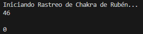</img>

<br></br>

## Reto 2.
Estandarizar la columna aldea.
```
print(df["aldea"].head(6))
df["aldea"] = df["aldea"].str.replace(' ', '')
df["aldea"] = df["aldea"].str.capitalize()
df["aldea"] = df["aldea"].str.rstrip("_")
print()
print(df["aldea"].head(6))
```

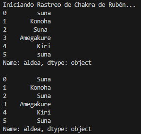</img>

<br></br>

## Reto 3.
Rellenar la columna  nin_id con "Ninja de la Niebla Anonimo" si nin_id es nulo y la aldea es Kiri.
```
print(df.loc[32:32, ["nin_id"]])
df.loc[(df["nin_id"].isna()) & (df["aldea"] == "Kiri"), "nin_id"] = "Ninja de la Niebla Anonimo"
print()
print(df.loc[32:32, ["nin_id"]])
```

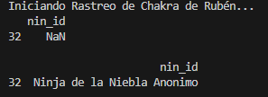</img>

<br></br>

## Reto 4.
Convertir la columna ts a datetime.
```
print(df.info())
df["ts"] = pd.to_datetime(df["ts"])
print(df.info())
```

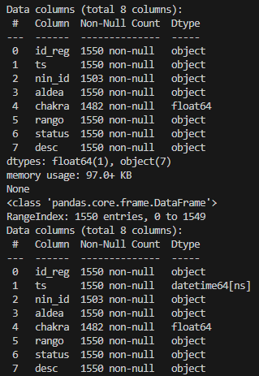</img>

<br></br>

## Reto 5.
Corregir valores de chakra imposibles.
```
print(df.loc[[2, 31], ["chakra"]])
mediana = df.loc[(df["chakra"] > 0) & (df["chakra"] <= 100000), "chakra"].median()
df.loc[(df["chakra"] <= 0) | (df["chakra"] > 100000) | (df["chakra"].isna()), "chakra"] = mediana
print(df.loc[[2, 31], ["chakra"]])
```

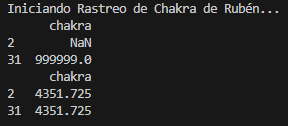</img>

<br></br>

## Reto 6.
Renombrar varias columnas.
```
print(df.info())
df = df.rename(columns={"id_reg": "ID", "ts": "Fecha", "nin_id": "Ninja", "status": "Estado", "desc":"Descripcion"})
print(df.info())
```

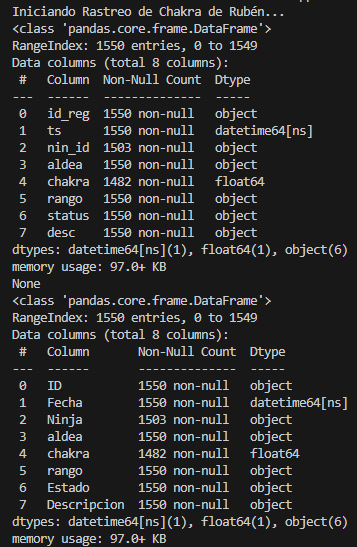</img>

<br></br>

## Reto 7.
Buscar descripciones con las palabras espía, sospechoso o enemigo.
```
print(df.loc[df["Descripcion"].str.contains("espía|sospechoso|enemigo"), "Descripcion"])
```

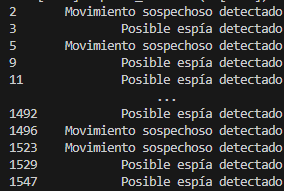</img>

<br></br>

## Reto 8.
Filtrar ninjas de la Aldea de la Lluvia que tengan más de 5000 de chakra y no sean de rango D.
```
ninjas = df[(df["aldea"] == "Amegakure") & (df["chakra"] > 5000) & (df["rango"] != "D")]
print(ninjas)
```

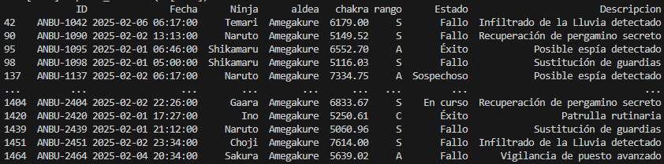</img>

<br></br>

## Reto 9.
Mostrar los accesos de entre las 23:00 y 05:00 horas.
```
accesos = df[(df["Fecha"].dt.hour >= 23)|(df["Fecha"].dt.hour < 5)]
print(accesos)
```

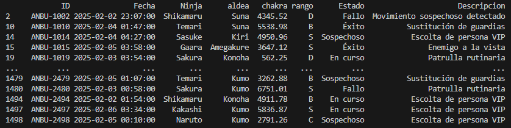</img>

<br></br>

## Reto 10.
Mostrar los ninjas con más chakra de cada aldea.
```
aldeas = df["aldea"].unique()
    for aldea in aldeas:
        print(df[df["aldea"] == aldea].sort_values(by="chakra", ascending=False).head(5))
        print()
```

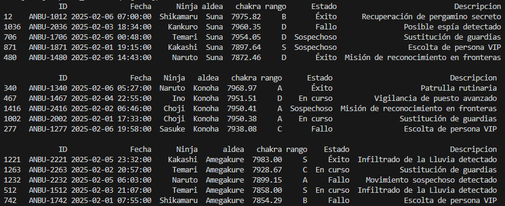</img>
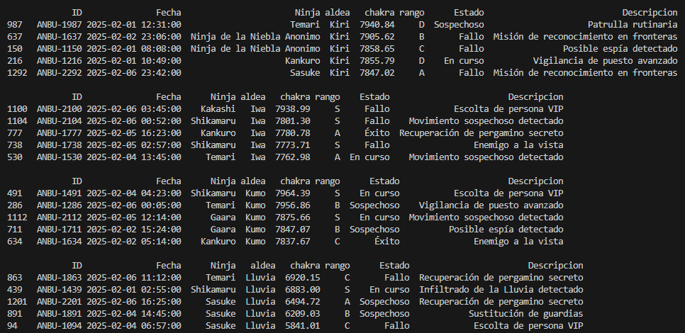</img>

<br></br>

## Reto 11.
Mostrar misiones de ninjas que no pertenezcan a las aldeas Konoha, Suna o Kumo.
```
misiones = df.loc[(df["aldea"] != "Konoha") & (df["aldea"] != "Suna") & (df["aldea"] != "Kumo"), "Descripcion"].unique()
    for mision in misiones:
        print(mision)
```

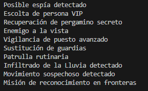</img>

<br></br>

## Reto 12.
Contar cuantas misiones falladas hay en cada aldea.
```
aldeas = df["aldea"].unique()
    for aldea in aldeas:
        print(aldea)
        print(df.loc[(df["aldea"] == aldea) & (df["Estado"] != "Fallo"), "Descripcion"].count())
        print()
```

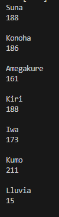</img>

<br></br>

## Preguntas de reflexión.
**1. ¿Cuántos registros duplicados has encontrado y qué impacto tendrían en un análisis de Big Data si no se eliminaran?**
Había 46 filas duplicadas. Alterarían métricas y resultados de consultas.

**2. ¿Por qué es crítico convertir la columna de fecha a datetime antes de realizar búsquedas por franja horaria?**
Porque sino lo convertimos la base de datos tomaría la fecha como un string y no podríamos (o sería más complicado) hacer consultas por fecha. 

**3. ¿Cómo has manejado los niveles de chakra > 100,000? ¿Crees que son errores de sensor o posibles técnicas prohibidas?**
He cambiado esos valores por la mediana de los valores "normales". Son valores muy altos como para ser errores del sensor.

**4. Conclusión: Breve opinión sobre cómo Pandas facilita el trabajo de un analista ANBU frente a una búsqueda manual en un pergamino de 1.500 líneas.**
Una busqueda manual es impensable incluso para una base de datos pequeña como esta, Pandas hace posible filtrar la información que queremos o necesitamos de forma sencilla.
