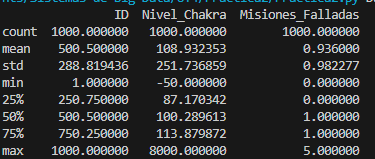
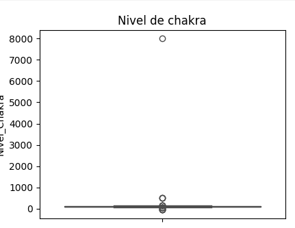
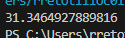
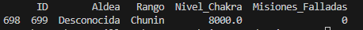
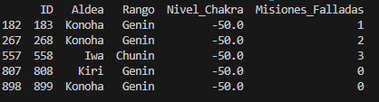
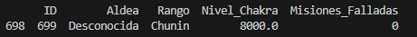
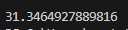
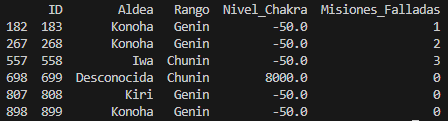

# Practica 2: El rostro del traidor.
En esta práctica nos centraremos en mostrar valores extremos (outliers) utilizando boxplot y Z-score.

## Ejercicio 1.
Utilizamos <code>print(df.describe())</code> para resolver varias preguntas.

</img>

**¿Cuál es la media de chakra?**
La media es 108,93.

**¿Cuál es la desviación estándar?**
La desviación es 251,74.

**¿Ves algún valor máximo sospechoso?**
El valor máximo del nivel de chakra parece muy elevado con respecto a la media.

<br></br>

## Ejercicio 2.
Utilizo una gráfica boxplot para mostrar los valores outliers del nivel de chakra.

```
plt.figure(figsize=(8, 6))
sns.boxplot(y=df["Nivel_Chakra"], color='orange')
plt.title('Nivel de chakra')
plt.show()
```

</img>

El valor 8000 es un valor muy extremo y sospechoso.

<br></br>

## Ejercicio 3.
Utilizo ahora el Z-score para filtrar los registros cuyo valor obtenido sea mayor o menor de 3.

```
Z = (df["Nivel_Chakra"] - df["Nivel_Chakra"].mean()) / df["Nivel_Chakra"].std()
for x in Z:
    if x >= 3 or x <= -3:
        print(x)
```

Obtengo un solo valor de 31,35.

</img>

Como sólo hay un único valor de Z mayor de 3 mostramos la fila con el nivel de chakra máximo.

```
print(df[df["Nivel_Chakra"] == df["Nivel_Chakra"].max()])
```
</img>

<br></br>

## Ejercicio 4.
Hago ahora varios filtrados para detectar más sospechosos.

**Buscar ninjas con chakra negativo**
```
chakra_negativo = df[df["Nivel_Chakra"] < 0]
print(chakra_negativo)
```

Encuentro 5 ninjas con chakra negativo.

</img>

**Buscar ninjas de la aldea Desconocida**
```
desconocida = df[df["Aldea"] == "Desconocida"]
print(desconocida)
```

Solo está el ninja del chakra outlier.
</img>

<b>Buscar Super Ninjas (Z-score entre 2 y 3)</b>
```
for x in Z:
    if x >= 2:
        print(x)
```

Sigue mostrando solo un valor mayor de 2.
</img>

<br></br>

## Ejercicio 5.
Muestro todos los datos de los sospechosos.
```
sospechosos = [183, 268, 558, 699, 808, 899]
print(df[df["ID"].isin(sospechosos)])
```
</img>

<br></br>

## Preguntas de reflexión.
**1. ¿Por qué un outlier puede ser un error del sensor y no necesariamente un ataque? Pon un ejemplo que hayas encontrado en el dataset.**
Puede ser un error del sensor porque puede estar defectuoso o puede haber sido dañado de alguna forma, lo que llevaría a valores menos fiables.

**2. Si eliminas los outliers, ¿cómo cambia la media del dataset? ¿Sube o baja?**
La media bajaría en este caso ya que el valor de 8000 de chakra aumenta en gran medida la media de la columna.

**3. ¿Sería justo castigar a los “Super Ninjas” (Z-Score > 2 pero < 3) solo por ser fuertes? Justifica tu respuesta estadística.**
Yo no he detectado ningún Super Ninja, pero no creo que debiesen ser castigados. Aunque un valor entre 2 y 3 pudiese ser sospechoso no me parece un valor demasiado extremo y podría ser un valor real.
