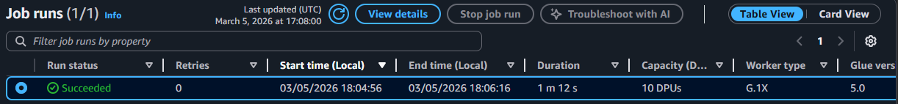
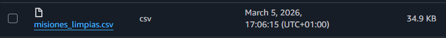
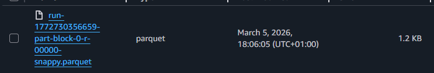

# Práctica 1. El Purificador de Pergaminos (ETL).
En esta práctica se configurará un ecosistema de Ingeniería de Datos en AWS Academy utilizando S3 y AWS Glue.

## 1. Evidencias del cloud.
Captura de Job de Glue finalizado.

</img>

## 2. Análisis de optimización.
Comparación de los tamaños de los archivos (CSV vs Parquet).

Formato CSV: 34,9 KB
</img>

Formato Parquet: 1,2 KB
</img>

## 3. Reflexión.
Ventajas del proceso "Serverless" frente a procesar el archivo con un script manual en local.

La ventaja principal sería la sencillez de hacerlo en AWS sin necesidad de programar un script. Además, un fichero CSV de Big Data puede llegar a contener varios terabytes de información, un peso de archivo de esa magnitud no cabe en los discos comunes que usan los ordenadores.
