# Práctica 2. El Índice de las Sombras (NoSQL)
El objetivo de esta práctica es diseñar una base de datos clave-valor para el acceso de alto rendimiento.

## Ejercicio 1. Creación de la tabla principal.
Creamos la tabla CensoAlianza con partition key ID_Ninja, sort key Fecha_Registro y capacidad "On-demand".

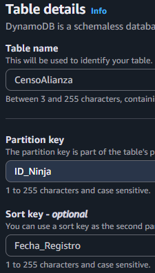</img>
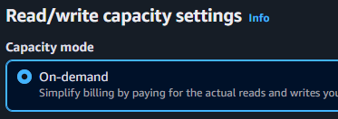</img>

  

## Ejercicio 2. Ingesta de datos críticos.
Creamos 5 registros cada uno con columnas diferentes.

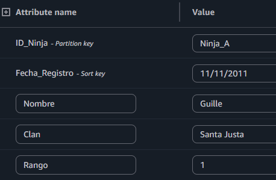</img>
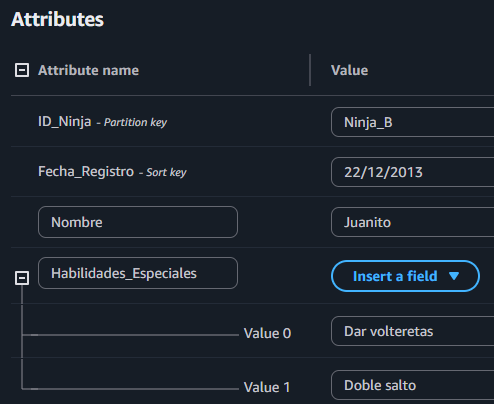</img>
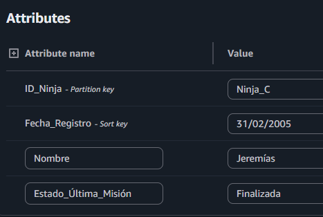</img>
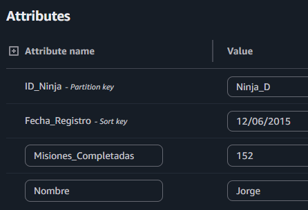</img>
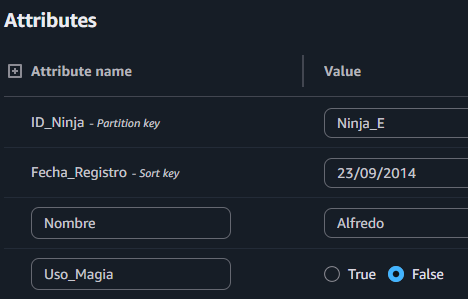</img>

  

## Ejercicio 3. Simulación de busqueda ANBU.
Uso una query para buscar por ID_Ninja.

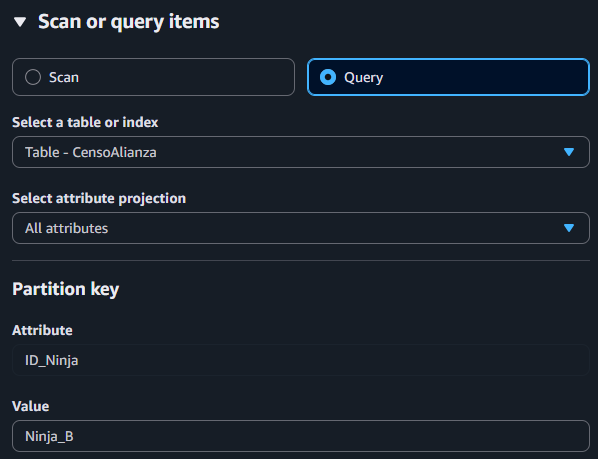</img>
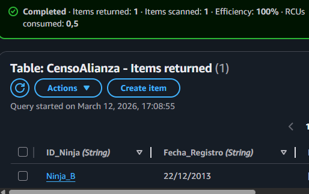</img>

  

Realizo ahora un escaneo para mostrar los ninjas de un clan específico.

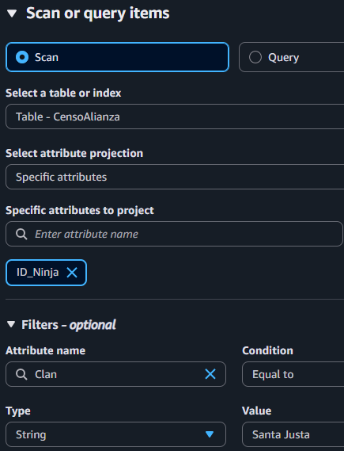</img>
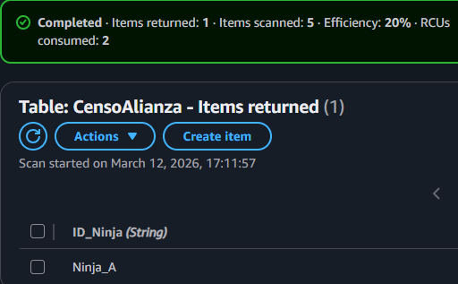</img>

El scan es más lento y costoso porque en vez de leer solo los registros que coinciden con la busqueda los lee todos.

  

## Ejercicio 4. Actualización dinámica.
Modifico un registro añadiendo el atributo Nivel_Amenaza.

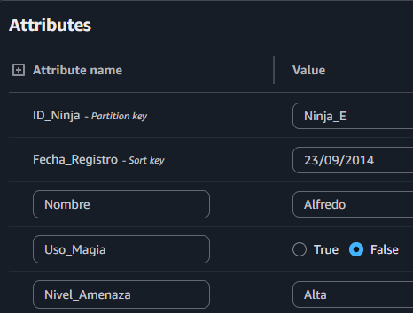</img>

  

## Análisis técnico.
Explica qué Partition Key elegirías si tuvieras que buscar habitualmente por “Aldea” en lugar de por “ID” y qué es un Global Secondary Index (GSI).

Pondría de partition key aldea. GSI es un índice secundario que permite hacer busquedas query a una table usando una partition key diferente.
