# Practica 3.

## Consulta 1. Número de misiones realizadas por cada ninja

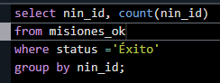</img>

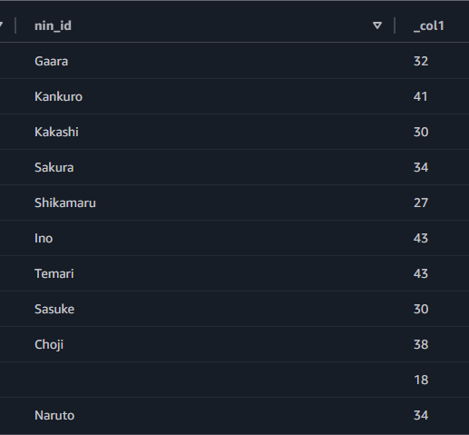</img>

  

## Conculta 2. Misiones completadas con éxito

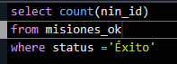</img>

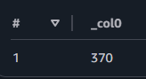</img>

  

## Conculta 3. Chakra medio usado por cada ninja

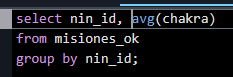</img>

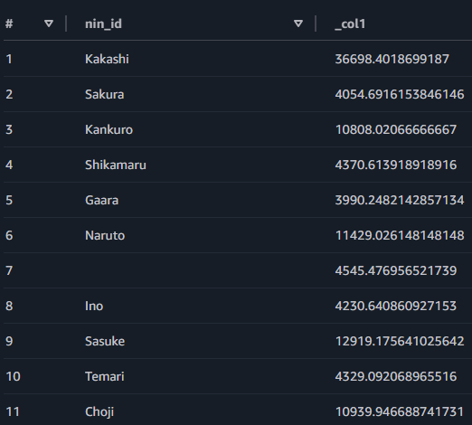</img>

  

## Conculta 4. Número de misiones por aldea

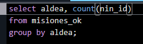</img>

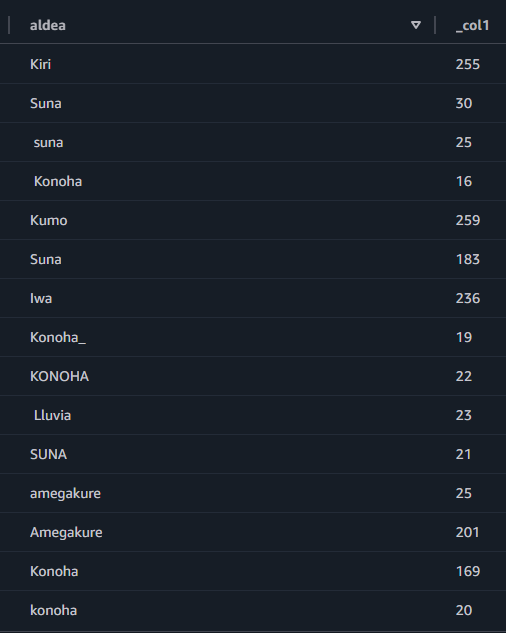</img>

  

## Conculta 5. Misiones de rango alto (A o S)

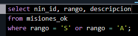</img>

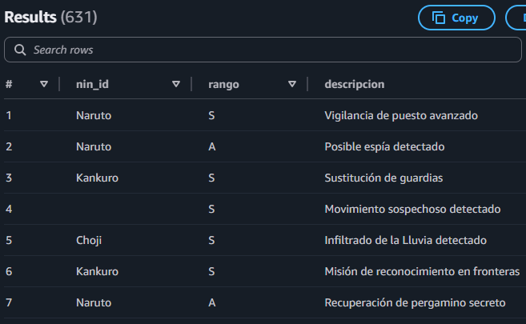</img>

  

## Conculta 6. Realiza un GROUP BY para encontrar qué aldea ha realizado más actividades sospechosas en el último mes.

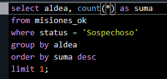</img>

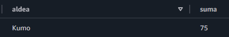</img>